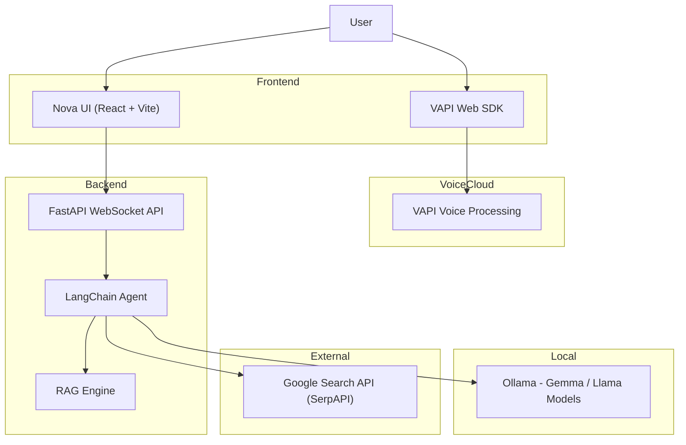

# Nova AI

**Nova AI** is a next-generation hybrid personal assistant that seamlessly blends cloud-based voice intelligence with local privacy-focused LLMs. It features a dual-architecture design: ultra-low latency voice interaction powered by **VAPI** and a private, locally hosted chat intelligence system using **Ollama** and **LangChain**.

## ✨ Key Features

### 🎙️ VAPI-Powered Voice Interface
*   **Direct-to-Cloud**: The frontend communicates directly with VAPI servers using the `@vapi-ai/web` SDK for near-zero latency.
*   **Visual Intelligence**: Features a real-time audio visualizer that reacts to volume levels and speech states (listening, thinking, speaking).
*   **Full State Handling**: Visual feedback for connection status, errors, and conversation flow.

### 🧠 Private Local Intelligence (Text Chat)
*   **Local LLM**: Uses **Ollama** (default `gemma3:1b`) running locally on your machine for complete privacy.
*   **Smart Orchestration**: **LangChain** agent dynamically decides when to use internal knowledge, web search, or document context.
*   **Persistent Memory**: Remembers conversation context within active sessions.

### 📄 RAG (Retrieval-Augmented Generation)
*   **Instant Document Analysis**: Upload PDFs directly to the chat.
*   **Context-Aware**: The system automatically switches context to answer questions specifically about your uploaded documents ("What does page 3 say?").
*   **Vector Search**: Efficiently retrieves relevant document chunks for accurate citations.

### 🌐 Live Web Search
*   **Real-Time Data**: Integrated **SerpAPI** (Google Search) to fetch live news, weather, and stock prices.
*   **Auto-Detection**: The agent intelligently detects when a query requires fresh information vs. general knowledge.

---

## �️ Architecture

Nova AI uses a **Hybrid Architecture** to optimize for both speed and privacy:



---

## 🛠️ Technology Stack

| Component | Technology | Version | Description |
|-----------|------------|---------|-------------|
| **Frontend** | React | 19.x | Modern UI library with Hooks |
| | Vite | 7.x | Next-generation frontend tooling |
| | Tailwind CSS | 4.x | Utility-first styling engine |
| | VAPI SDK | 2.x | Real-time voice AI integration |
| **Backend** | Python | 3.10+ | Core server language |
| | FastAPI | 0.109+ | High-performance Async API |
| | LangChain | 0.3+ | LLM orchestration framework |
| | PyPDF | 4.x | PDF extraction and processing |
| **AI/Model** | Ollama | Latest | Local LLM runner |
| | SerpAPI | 2.x | Google Search wrapper |

---

## ⚡ Quick Start Guide

### Prerequisites
*   **Node.js 18+** installed
*   **Python 3.10+** installed
*   **Ollama** running locally (`ollama serve`)
*   **VAPI Account** (for Voice)
*   **SerpAPI Account** (Optional, for Web Search)

### 1. 🧠 Setup Local LLM
Ensure Ollama is installed and pull the model:
```bash
ollama pull gemma3:1b
# Or any other model, just update backend/.env
```

### 2. 🐍 Backend Setup (The Brain)
```bash
cd backend

# Create virtual environment
python -m venv venv
source venv/bin/activate  # Windows: venv\Scripts\activate

# Install dependencies
pip install -r requirements.txt

# Configure Environment
cp .env.example .env  # Or create new
# Edit .env with:
# PORT=8000
# OLLAMA_MODEL=gemma3:1b
# SERPAPI_KEY=your_key_here
```

**Run the Server:**
```bash
python main.py
```

### 3. 🎨 Frontend Setup (The Face)
```bash
cd frontend

# Install dependencies
npm install

# Configure Environment
# Create .env file with:
# VITE_VAPI_PUBLIC_KEY=your_public_key
# VITE_VAPI_ASSISTANT_ID=your_assistant_id
```

**Run the UI:**
```bash
npm run dev
```
Open `http://localhost:5173` in your browser.

---

## 🎮 How to Use

### Voice Mode 🗣️
1.  Click the **Microphone** button in the bottom-right.
2.  Wait for the status to say **"Ready"**.
3.  Click **"Start Call"**.
4.  Speak naturally! Nova will listen (Green state), think (Processing state), and respond.
5.  *Note: This uses VAPI credits.*

### RAG / Document Mode 📄
1.  Click the **Upload** icon in the sidebar.
2.  Select a **PDF** document.
3.  Wait for the "PDF Loaded" confirmation.
4.  Ask questions like *"Summarize the introduction"* or *"List the key points on page 5"*.

### Web Search 🌍
1.  Just ask about current events!
2.  *"What is the weather in Tokyo?"*
3.  *"Who won the Super Bowl in 2024?"*
4.  Nova will detect the need for external info and search the web automatically.

---

## 🤝 Contributing
Built with ❤️ by the Nova AI Team. PRs are welcome!
